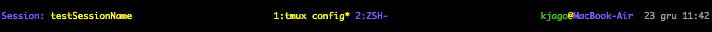

# tmux
My own .tmux.config which provide some useful shortcuts and add some custom changes in status bar template.

# requirements
[Tmux plugin manager](https://github.com/tmux-plugins/tpm)

# status bar template

